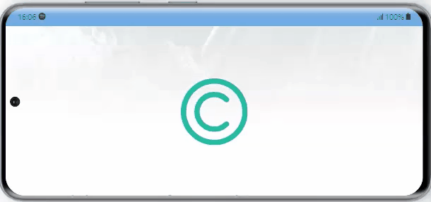
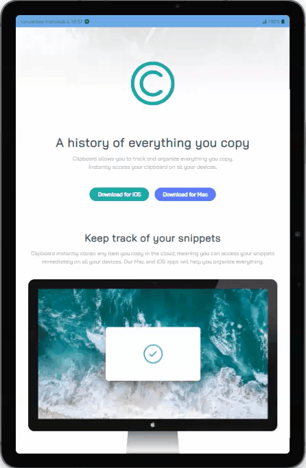

# Clipboard #  

## Description ##  
This project is a landing page for a fictional application.  
It was inspired by a mockup found on **Frontend  Mentor** .  
The colors, fonts, images and general layout used were provided in said mockup and a few changes were made.  

## Demo ##  
A deployment with **Github Pages** is available [here](https://laetitiabodin.github.io/clipboard).

  
Smartphone - portrait
 
  
  

  
Smartphone - landscape
 
    
  

  
Tablet - portrait
 
    
  

  
Tablet - landscape
 
    
  

  
Laptop
 
    
  

## Development ##  

### React ###  
This app was created with [Create React App](https://create-react-app.dev/).  
A default `README` file was created with a few basic commands.  
It can be found [here](ReadMe/README.md).
  
### Typescript ###
This app uses **Typescript**.  
The config file can be found [here](tsconfig.json).
 
### TailwindCSS ###  
This app uses **TailwindCSS**.  
The config file can be found [here](tailwind.config.js).  
Find out more about TailwindCSS [here](https://tailwindcss.com/). 

### Environment ###  
A `.env` is created to contain the variable name for the build.  
No sensitive information is to be stored in that file.  
It is mainly used to create the absolute url for the `meta` tags (SEO).

### SEO ###  
`meta` tags with **Open Graph** and **Twitter cards** information are used.  
Find out more about Open Graph [here](https://ogp.me/).  
Find out more about Twitter cards [here](https://developer.twitter.com/en/docs/twitter-for-websites/cards/overview/markup).

### Icons ###  
**Canva** was used to create a `favicon` and a `card image` from the logo provided in the project starter pack.  
Find out more about Canva [here](https://www.canva.com/).  
Icons (SVGs) are directly embedded in the HTML.

## Project structure ##  

### Folders ###  
The main structure is as follows:
- **`public`**  
  - **`db`** ➜ a collection of json files that will be used as a mock database.  
  - **`img`** ➜ a collection of pictures that will be used as images and not edited during the building  
    - **`meta`** ➜ pictures used for the *meta tags*
    - **`pics`** ➜ pictures used for the illustrations in the *body*
- **`src`**  
  - **`components`** ➜ basic elements that will be exported to be used with bigger elements  
  - **`img`**  
    - **`bg`** ➜ pictures that will either serve as backgrounds 
    - **`icons`** ➜ pictures that will serve as embedded SVGs
  - **`layout`**
    - **`common`** ➜ components that will be used in more than 1 part of the layout  
    - **`Header`** **`Main`** **`Footer`**  
      - `Header.tsx` `Main.tsx` `Footer.tsx` ➜ Main parts of the *body*  
      - `_Xxxx` ➜ Bits that will be gathered in the current folder's main part  
  - `App.css` ➜ Tailwind basefile with a few custom styles
  - `proptypes.tsx` ➜ interfaces for the props  
  - `routes.ts` ➜ routes used for the links
  - `utils.ts` ➜ functions that will be used for better code readability  
- `.env` ➜ environment variables.  
- `package.json` ➜ file that lists the dependencies and the scripts for the project  
- `tailwind.config.js` ➜ config file for Tailwind  

### Tweaks ###  
SVGs icons are all gathered in the `src/img/icons` folder.  
In `icons.tsx`, these icons are 'converted' to React components and exported.  
To facilitate their use, they are exported in an object that will serve as some kind of collection whith *key*/*value* pairs. In other components, when an icon is needed, it will be found thanks to its key.   
Because of Typescript, an `IconsType` is created in that file to serve as type casting. 

### Types ###  
*Interfaces* and *types* for the *props* are gathered in `proptypes.tsx` and exported.  
An `IconType` is done on its own because it is linked to a collection of components.  

### Data and assets ###  
The project is not linked to a database. Instead, `.json` files are used to simulate one.  
When it comes to images and svgs, the values in said `.json` refer to filenames or the keys used.  
An update of one may necessitate the update of another other.

## Credits ##  
The code was written by **Laëtitia Bodin** and was inspired by a free-to-use challenge from **Frontend Mentor**.  
More info regarding said challenge can be found [here](https://www.frontendmentor.io/challenges/clipboard-landing-page-5cc9bccd6c4c91111378ecb9).

## Troubleshooting ##  
Should you experience some bug or want to offer some feedback regarding this project, feel free to open an issue for this repo and label it accordingly.  
Should you experience warnings regarding missing dependencies or updates needed, you might need to run `npm install` or `npm update`.